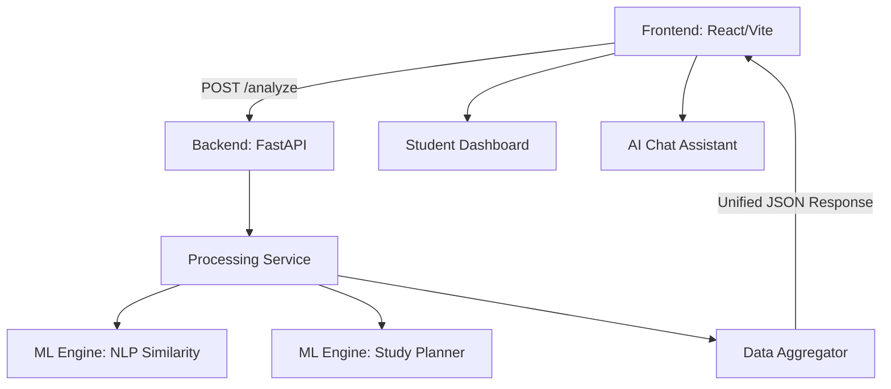

# 🧠 Sehpaathi AI (V4.1) — Intelligent Learning Gap Analyzer

> **"Transforming static marks into dynamic mastery protocols."**

Sehpaathi AI is a production-grade pedagogy analytics engine designed to identify deep conceptual learning gaps at scale. By merging **NLP-based Answer Similarity** with **Precision Marks Data**, it creates a "Grip Score" that informs 7-day personalized mastery protocols for students and high-fidelity diagnostics for educators.

---

## 🚀 The Problem & Our Solution

### **The Problem**
Traditional grading focuses on **Correctness (Marks)** but ignores **Conceptuality (The "Why")**. A student can score 90/100 through pattern matching without truly understanding the core principles.

### **The Solution**
Sehpaathi AI introduces the **Hybrid Grip Score (HGS)**:
- **0.7 Weight (Accuracy)**: Validates the technical result.
- **0.3 Weight (NLP Similarity)**: Validates conceptual reasoning against model benchmarks.

---

## ✨ Key Features (V4.1)

- **Dual-Stream Analytics**: Simultaneously process NLP corpora (Answers) and Analytics streams (Marks).
- **Interactive Performance Spectrum**: Radar & Bar visualizations for comprehensive strength detection.
- **7-Day Mastery Protocol**: Auto-generated, dynamic study plans derived from real-time performance gaps.
- **Unified AI Chat Assistant**: Context-aware queries (e.g., *"What is the most critical subject gap in Section A?"*).
- **Proactive Interventions**: "Critical Score Gap" banners to highlight the most impactful areas for improvement.

---

## ⚙️ Tech Stack

### **Frontend**
- **React 18**: Component-based UI for high performance.
- **Vite**: Ultra-fast module bundling.
- **Framer Motion**: Premium, fluid UI animations.
- **Recharts**: High-fidelity data visualizations.
- **Tailwind CSS**: Utility-first, professional design system.

### **Backend**
- **FastAPI**: High-performance, asynchronous REST API.
- **Python ML Stack**: Pandas, Scikit-Learn (TF-IDF, Cosine Similarity).
- **Pydantic**: Robust data validation and serialization.

---

## 🏗️ Architecture

---

## 📊 Screenshots & UI

*(Replace these with your actual screenshots after deployment)*

### **1. Performance Overview**

*Visualizing the Grip Score Spectrum and student percentile.*

### **2. Mastery Protocol (7-Day Plan)**

*Personalized remedial sequences generated automatically.*

---

## 🌐 Live Demos

- **Frontend**: [sehpaathi-ai.vercel.app](https://your-vercel-link.app)
- **Backend**: [sehpaathi-api.onrender.com](https://your-render-link.onrender.com)

---

## 🔮 Future Scope

1. **Multi-Model NLP**: Support for Transformer-based embeddings (BERT/Llama) for deeper semantic search.
2. **Predictive Grading**: Early warning systems to flag students at risk of falling behind.
3. **Teacher Remediation Hub**: Integrated tools for teachers to assign specific content to "Weak Topic" clusters.

---

## 🤝 Contributors

- **Your Name** — *Lead Developer & Architect*

---

*This project was built to empower education through intelligent, data-driven analytics. Aligning with **UN SDG 4**.*
