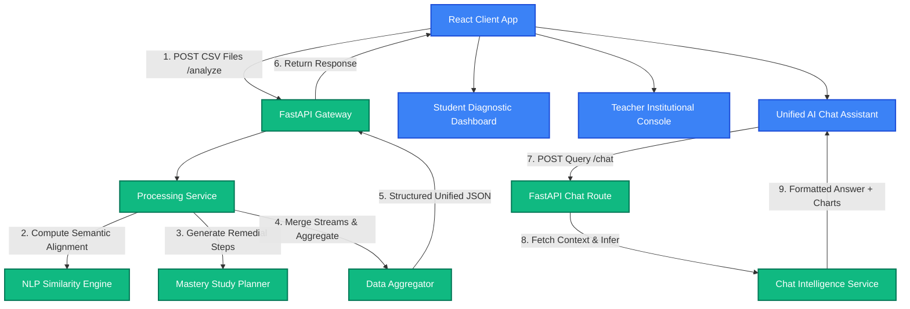
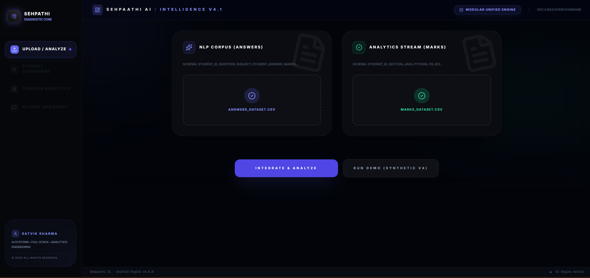
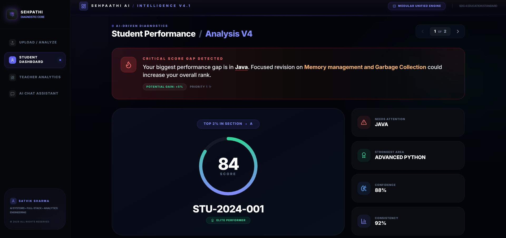
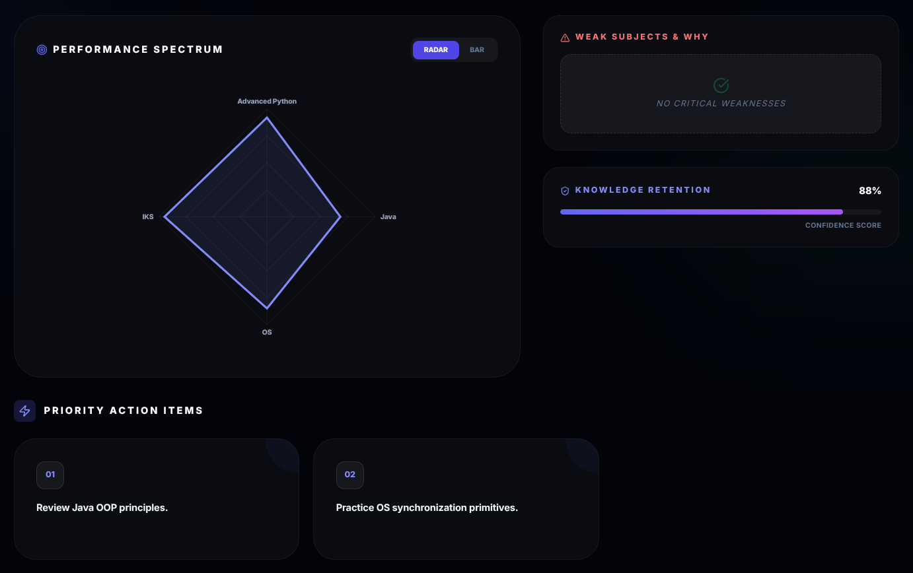
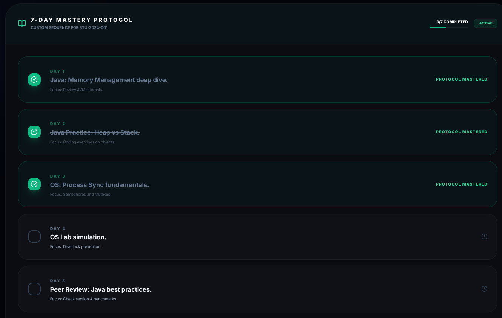
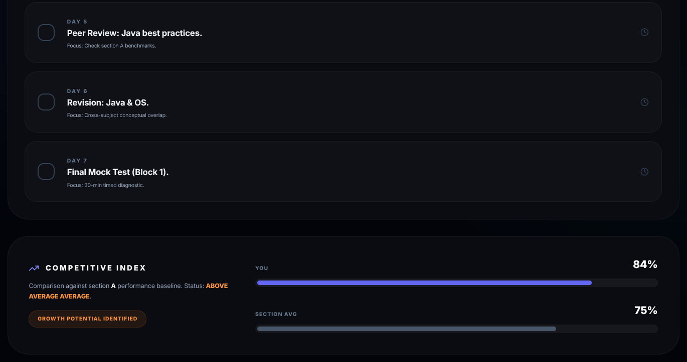
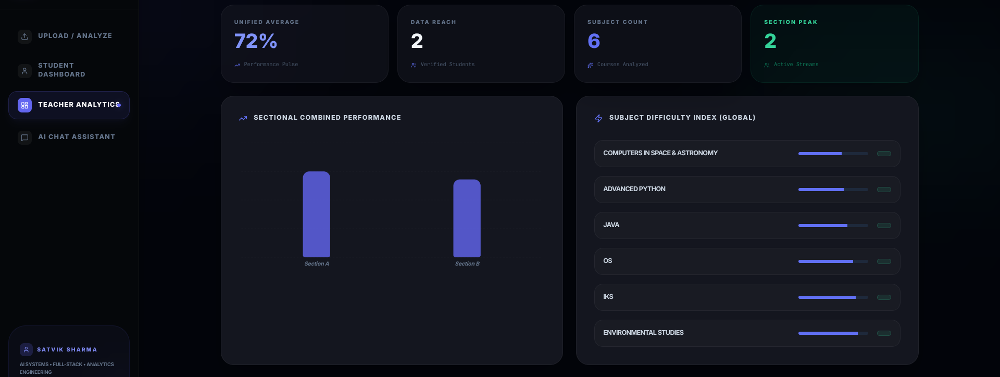
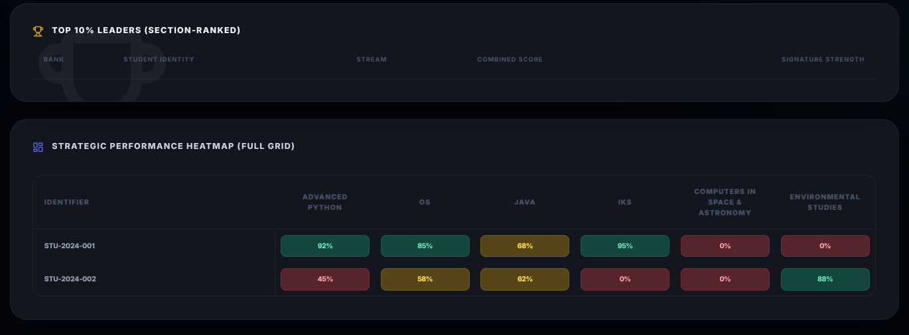

# 🧠 Sehpaathi AI (V4.1) — Intelligent Learning Gap Analyzer

[](https://sehpaathi-a-iv2.vercel.app)
[](https://sehpaathiiv2-backend.onrender.com)
[](https://sdgs.un.org/goals/goal4)
[](#)
[](#)

> **"Bridging the divide between correctness and conceptual understanding. Transforming static grades into personalized, action-oriented mastery protocols."**

Sehpaathi AI is a production-grade education analytics engine designed to detect and close deep conceptual learning gaps at scale. Built to align with **United Nations Sustainable Development Goal (SDG) 4: Quality Education**, it shifts the paradigm from traditional correctness-based grading to **conceptual mastery diagnosis**.

By merging **Natural Language Processing (NLP) answer similarity** with **quantitative student marks**, the system calculates a unified **Hybrid Grip Score (HGS)**. It uses these scores to auto-generate personalized 7-day mastery study sequences and provide institutional diagnostics for educators.

---

## 🚀 The Core Problem & The HGS Framework

### **The Problem**
Traditional grading evaluates **Correctness (Marks)** but fails to diagnose **Conceptuality (Reasoning)**. 
- A student might guess a multiple-choice question correctly or memorize a key phrase to secure high marks.
- Another student might grasp the underlying concept but fail to articulate it in the exact syntax expected by a rubric, receiving low marks.
- Conventional grade sheets do not provide *actionable remediation paths*.

### **The Solution: Hybrid Grip Score (HGS)**
Sehpaathi AI evaluates performance through a multi-dimensional metric that balances raw scoring with conceptual alignment. The **Hybrid Grip Score (HGS)** for any given subject/topic is calculated as:

$$\text{HGS} = (0.7 \times \text{Normalized Accuracy}) + (0.3 \times \text{NLP Semantic Similarity})$$

#### **1. Normalized Accuracy (Weight: 0.7)**
Evaluates structural correctness:
$$\text{Normalized Accuracy} = \frac{\text{Obtained Marks}}{\text{Total Marks}}$$

#### **2. NLP Semantic Similarity (Weight: 0.3)**
Compares the student's natural language response against a validated model answer:
- **Vector Space Modeling**: Converts text to numerical representation using TF-IDF (Term Frequency-Inverse Document Frequency).
- **Cosine Similarity**: Measures the angular distance between the student's answer vector ($\mathbf{S}$) and the model's benchmark answer vector ($\mathbf{M}$):
  $$\text{Cosine Similarity} = \frac{\mathbf{S} \cdot \mathbf{M}}{\|\mathbf{S}\| \|\mathbf{M}\|}$$
- **Brevity Penalty**: Short or evasive answers (e.g., *"I don't know"*) are penalized mathematically to prevent high similarity scores resulting from sparse matching.

---

## 🏗️ System Architecture & Data Flow

The codebase is organized as a decoupled full-stack application. The frontend orchestrates interactive client views while the backend executes NLP similarities and study plan generations.



---

## 🎨 Interactive Interface Showcase

The system maps out institutional, class, and individual performance profiles across eight layout screens:

### **1. Dashboard Analytics**

*High-level institutional statistics summarizing student counts, section distributions, average overall scores, and system confidence levels.*

### **2. Institutional Stats**

*Distribution curves, percentile curves, and key metrics showing student performance bands.*

### **3. Performance Heatmaps & Gap Analysis**

*An interactive color-coded matrix displaying student-to-subject mastery states. It instantly highlights deep learning gaps across different classes.*

### **4. Student Diagnostic Dashboard**

*A student-centric view displaying individual percentile rankings, best-performing subjects, and weakest areas requiring immediate support.*

### **5. Mastery Protocol (7-Day Remedial Plan)**

*The auto-generated, step-by-step sequence detailing what a student must study day-by-day to close identified knowledge gaps.*

### **6. Suggestions & Actionable Remediation**

*Granular, concept-by-concept feedback outlining *why* a particular gap exists and recommendations for specific learning actions.*

### **7. Teacher Diagnostic Console**

*Allows educators to analyze class-wide trends, sort student scores, filter by sections, and view aggregated subject challenges.*

### **8. Upload & Processing Engine**

*The processing console. It parses quantitative marks and text answers, rendering real-time execution steps through an animated console.*

---

## 📂 Repository Structure

```
SehpathiAIv2/
├── backend/                   # Python FastAPI REST API
│   ├── main.py                # ASGI application entrypoint & CORS setup
│   ├── requirements.txt       # Python ML stack dependencies
│   ├── schemas.py             # Pydantic request/response structures
│   ├── api/
│   │   └── routes.py          # API route handlers (/analyze, /chat, etc.)
│   ├── services/
│   │   ├── processing.py      # Core data merge, scaling, & aggregation service
│   │   └── chat_service.py    # AI diagnostic query router
│   ├── ml/
│   │   ├── analyzer.py        # Cosine similarity and brevity analyzer
│   │   └── study_planner.py   # Dynamic remedial plan generator
│   └── data/                  # Sample student response datasets
│       ├── marks_dataset.csv
│       └── answers_dataset.csv
├── frontend/                  # React Client Application
│   ├── package.json           # Frontend build scripts and dependencies
│   ├── vite.config.js         # Vite configuration with resolver aliases
│   ├── tailwind.config.js     # Tailwind CSS theme configuration
│   ├── eslint.config.js       # ESLint configurations
│   ├── src/
│   │   ├── main.jsx           # React app mount point
│   │   ├── App.jsx            # Core layout manager & routing
│   │   ├── index.css          # Tailwind configurations & custom styles
│   │   ├── components/        # Reusable dashboard UI blocks
│   │   │   ├── Sidebar.jsx    # Sticky navigation sidebar
│   │   │   ├── UploadSection.jsx # File drag-and-drop & API uploader
│   │   │   ├── ThinkingLog.jsx # Simulated terminal output during analysis
│   │   │   ├── AIChatAssistant.jsx # AI Chat window component
│   │   │   ├── StatsBar.jsx   # Metrics strip (top of dashboard)
│   │   │   ├── StudentDashboard.jsx # Individual student diagnostics
│   │   │   ├── TeacherDashboard.jsx # Institutional/Class stats view
│   │   │   └── dashboard/
│   │   │       ├── ScoreOverview.jsx
│   │   │       ├── PerformanceAnalytics.jsx
│   │   │       └── MasteryPlan.jsx # 7-day study plan UI
│   │   └── data/
│   │       └── demoData.js    # Offline/fallback dataset
│   └── public/                # Static assets (logo, icons, etc.)
└── .gitignore                 # Root gitignore excluding pycache and venvs
```

---

## ⚙️ Local Development Setup

### **Prerequisites**
- **Node.js** (v18.0.0 or higher)
- **Python** (v3.10 or higher)
- **git**

### **1. Backend Installation & Startup**
1. Navigate to the backend directory:
   ```bash
   cd backend
   ```
2. Create a virtual environment and activate it:
   ```bash
   python -m venv .venv
   source .venv/bin/activate
   ```
3. Install dependencies:
   ```bash
   pip install -r requirements.txt
   ```
4. Start the FastAPI development server:
   ```bash
   uvicorn main:app --host 127.0.0.1 --port 8000 --reload
   ```
   The backend API will now be live at `http://127.0.0.1:8000`. You can inspect the interactive OpenAPI docs at `http://127.0.0.1:8000/docs`.

### **2. Frontend Installation & Startup**
1. Open a new terminal session and navigate to the frontend directory:
   ```bash
   cd frontend
   ```
2. Install npm packages:
   ```bash
   npm install
   ```
3. Create a local environment file `.env`:
   ```bash
   echo "VITE_BACKEND_URL=http://127.0.0.1:8000" > .env
   ```
4. Start the Vite hot-reloading development server:
   ```bash
   npm run dev
   ```
   Open `http://localhost:5173` in your browser to view the application.

---

## 🌐 Production Deployment

### **Backend (Render)**
The backend is optimized for Render hosting.
1. Create a Web Service on Render linked to the GitHub repository.
2. Set the **Build Command** to:
   ```bash
   pip install -r backend/requirements.txt
   ```
3. Set the **Start Command** to:
   ```bash
   cd backend && uvicorn main:app --host 0.0.0.0 --port $PORT
   ```
4. Ensure the backend environment is configured properly.

### **Frontend (Vercel)**
The frontend is optimized for zero-config deployments on Vercel.
1. Create a new project on Vercel linked to the repository.
2. Set the **Root Directory** to `frontend`.
3. Add the following **Environment Variables**:
   - `VITE_BACKEND_URL`: Set to the live production URL of your Render backend (e.g., `https://sehpaathiiv2-backend.onrender.com`).
4. Click **Deploy**. Vercel will bundle the static build into `/dist` and host it globally.

---

## 🔮 Future Roadmap

1. **Transformer Embeddings (BERT / LLMs)**: Move from TF-IDF vectors to dense semantic vectors (e.g., `sentence-transformers` or Cohere/OpenAI embeddings) for deeper understanding of paraphrasing.
2. **Predictive Diagnostic Warnings**: Utilize classification trees to flag students at risk of dropping below the mastery threshold in upcoming evaluations.
3. **Teacher Remediation Recommender**: Suggest specific remedial resource links (e.g., Kahn Academy or custom YouTube playlists) mapped to each of the generated 7-day study steps.

---

## 🤝 Authors & Credits

- **Satvik Sharma** - *Lead Full-Stack Developer & AI System Architect*

*This project was built to empower education systems globally through advanced learning analytics.*
